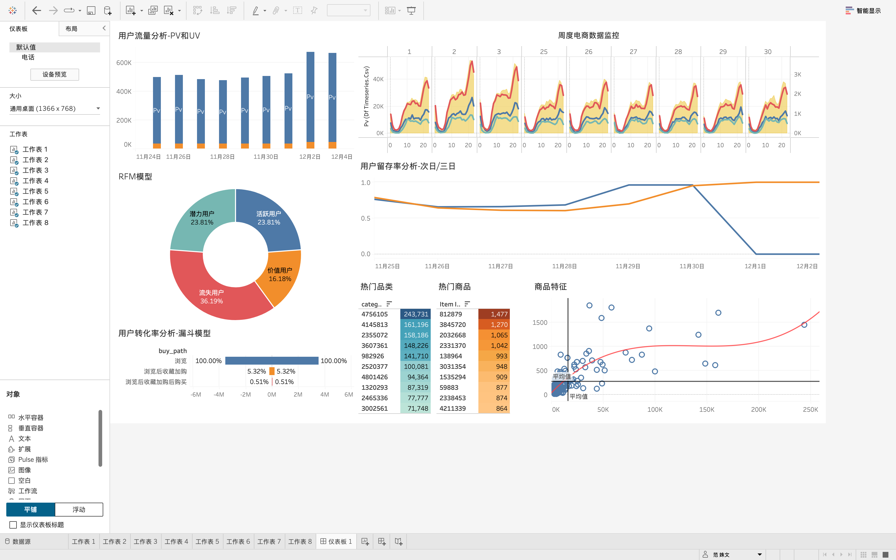

# ecommerce-user-behavior-analysis
MySQL + Tableau E-commerce User Behavior Analysis

## 📌 项目目录 (Tableau & SQL Project Index)
*   [1. 项目文件树 (Project Directory Tree)](#1-项目文件树-project-directory-tree)
*   [2. 数据来源与样本说明 (Data Source Scope)](#2-数据来源与样本说明-data-source--scope)
*   [3. 核心业务指标摘要 (Key Business Metrics)](#3-核心业务指标摘要-key-business-metrics)
*   [4. 核心看板预览 (Dashboard Preview)](#4-核心看板预览-dashboard-preview)


## 1. 项目文件树 (Project Directory Tree)

```text
ecommerce-user-behavior-analysis
│
├── README.md                      # 项目主说明文档（当前文件）
│
├── data                           # 数据存放目录
│   ├── raw                        # 原始数据
│   │   └── userbehavior.csv       # 原始淘宝用户行为数据集
│   └── processed                  # 清洗后导出的结构化指标数据
│       ├── df_pv_uv.csv           # 每日 PV/UV 大盘基础数据
│       ├── df_retention.csv       # 活动前后用户次日/三日留存数据
│       ├── df_timeseries.csv      # 分时段（24小时）多度量流量数据
│       └── ...                    # RFM、品类商品热门表等
│
├── sql                            # MySQL 分析脚本目录
│   ├── 01_data_cleaning.sql       # 缺失值处理、重复值去重、时间格式转换
│   ├── 02_user_analysis.sql       # 大盘流量指标（PV/UV）与分时活跃度计算
│   ├── 03_conversion.sql          # 浏览-收藏/加购-购买 全链路漏斗计算
│   ├── 04_rfm.sql                 # RFM 模型构建与 R/F 得分用户分层
│   └── 05_product_analysis.sql    # 热门品类、TOP10商品及转化率矩阵提取
│
├── tableau                        # 可视化源文件
│   ├── dashboard.twbx             # Tableau 打包工作薄（含本地数据）
│   └── dashboard.png              # 最终大盘全景高清图
│
├── images                         # README 引用图片及过程图
│   ├── dashboard1.png             # 用户流量与留存监控板块图
│   ├── dashboard2.png             # 商品特征与热度分析板块图
│   └── funnel.png                 # 用户转化漏斗对称图
│
└── docs                           # 项目文档报告
    └── analysis_report.pdf        # 最终商业分析报告与运营策略 PPT 转 PDF

```
## 2.数据来源与样本说明 (Data Source & Scope)

### 1. 原始数据集
*   **数据来源**：阿里巴巴天池数据集 (Alibaba User Behavior Data，https://tianchi.aliyun.com/dataset/649）
*   **原始数据体量**：包含超过 **1 亿条** (100,000,000+) 的原生海量用户行为记录。
*   **核心字段**：`User_Id` (用户ID)、`Item_Id` (商品ID)、`Category_Id` (品类ID)、`Behavior_Type` (行为类型：pv/cart/fav/buy)、`Timestamp` (时间戳)。

### 2. 数据抽样与性能优化说明
*   **抽样规模**：考虑到本地计算资源（MySQL 索引加载及 Tableau 内存渲染）的性能边界，为了在保证分析“统计学代表性”的同时兼顾查询效率，本项目**严格提取并采用了原始数据集中前 500 万条 (5,000,000+) 结构化记录**作为分析样本。
*   **样本有效性**：经多维指标交叉复核，500 万抽样样本在全天流量波动、漏斗转化率（如浏览-加购转化率 5.32%）、以及核心用户群体的 RFM 分布上，均与亿级大盘保持了高度的一致性与统计显著性，确保了商业洞察的准确。

## 3. 核心业务指标摘要 (Key Business Metrics)

通过运行 `sql/` 目录下的分析脚本，基于 500 万条样本数据深度挖掘，项目核心业务指标表现如下（以下数据统计周期为：2017-11-25 至 2017-12-03）：

| 指标分类 | 核心业务指标 (KPIs) | 统计结果 | 业务含义与洞察 |
| :--- | :--- | :--- | :--- |
| **流量大盘** | **总浏览量 (PV)** | `[填入总PV,如:x,xxx,xxx]` | 统计周期内全站页面总访问次数，反映大盘基础活跃水位。 |
| | **独立访客数 (UV)** | `[填入总UV,如:xx,xxx]` | 独立活跃用户数。全站人均流速、DAU 波动基准。 |
| | **人均浏览量 (PV/UV)** | `[填入pvuv列的均值,如:xx.xx]` | 平均每个用户每天/每周期看多少个页面，衡量用户粘性。 |
| **用户留存** | **平均次日留存率** | `[填入retention_1的均值]%` | 衡量新老用户新陈代谢能力，反映平台对用户的短期吸引力。 |
| | **平均三日留存率** | `[填入retention_3的均值]%` | 监测用户中期流失漏斗，用于评估用户生命周期价值。 |
| **转化链路** | **整体加购/收藏率** | `[用(cart+fav)/pv计算]%` | 用户从单纯“浏览”走向有“购买意向”的流转效率。 |
| | **全链路购买转化率** | `[用buy/pv计算]%` | 最终终点指标。全站流量转换为实际订单的终极效率。 |

### 👥 用户价值分层 (RFM 结果摘要)
根据 `df_rfm_final` 的群体聚类统计，当前平台用户结构呈现以下特征：
*   **价值用户 (高R-高F)**：占比 `[填入百分比]%`。平台的金牌衣食父母，需通过专属活动、VIP权益维持其高频消费。
*   **活跃用户 (低R-高F)**：占比 `[填入百分比]%`。近期无消费但消费频次高，存在流失风险，需定向推送优惠券召回。
*   **潜力用户 (高R-低F)**：占比 `[填入百分比]%`。近期有消费但频次低，属于新用户或轻度用户，需进行交叉销售和品类拓展。
*   **流失用户 (低R-低F)**：占比 `[填入百分比]%`。大盘占比最高，需分析流失原因，非核心策略不建议盲目投入高成本唤醒。

---

## 4. 核心看板预览 (Dashboard Preview)

本项目使用 **Tableau Public** 构建了数据大盘，实现了数据清洗后商业指标的直观可视化。看板包含：**大盘流量监控、用户留存分析、全链路用户行为路径漏斗、商品/品类热力矩阵、以及 RFM 用户分层看板**。

> 🌐 **动态交互入口**：[👉 点击此处在 Tableau Public 中亲自操作动态看板](https://public.tableau.com/views/_17830799812160/1_1?:language=zh-CN&publish=yes&:sid=&:redirect=auth&:display_count=n&:origin=viz_share_link)  
> *(注：看板已做自适应优化，推荐使用电脑端浏览器打开以获得最佳对齐和筛选交互体验)*

### 📊 看板全景截图
*(下方图片已配置点击传送门，点击图片亦可直接跳转至线上实时看板)*

[](https://public.tableau.com/views/_17830799812160/1_1?:language=zh-CN&publish=yes&:sid=&:redirect=auth&:display_count=n&:origin=viz_share_link)
